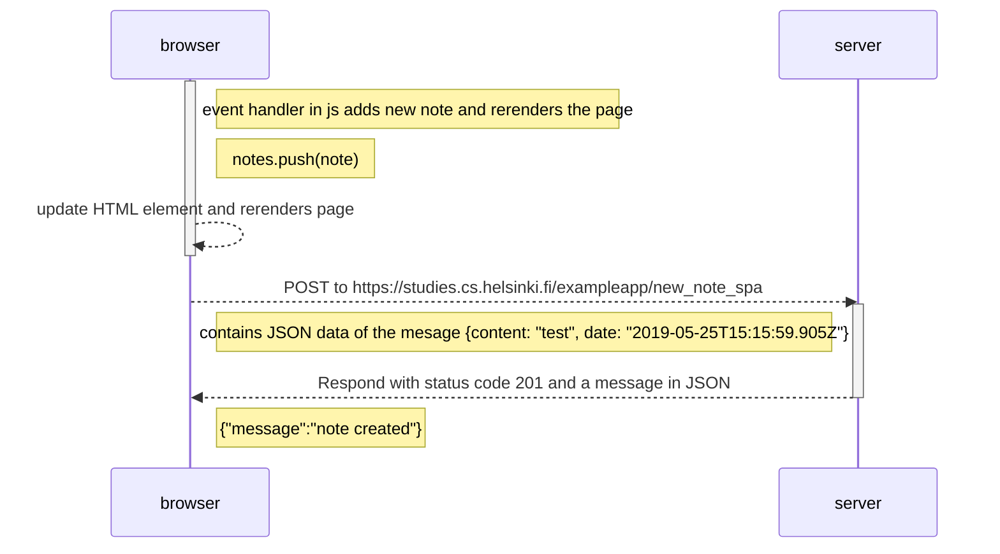

Creating a new note in SPA :

```mermaid
sequenceDiagram
  participant browser
  participant server

  activate browser
  Note right of browser: event handler in js adds new note and rerenders the page
  Note right of browser: notes.push(note)
  browser-->>browser: update HTML element and rerenders page
  deactivate browser

  browser-->>server: POST to https://studies.cs.helsinki.fi/exampleapp/new_note_spa
  activate server
  Note right of browser: contains JSON data of the mesage {content: "test", date: "2019-05-25T15:15:59.905Z"}
  server-->>browser: Respond with status code 201 and a message in JSON
  deactivate server
  Note right of browser: {"message":"note created"}
  
```
