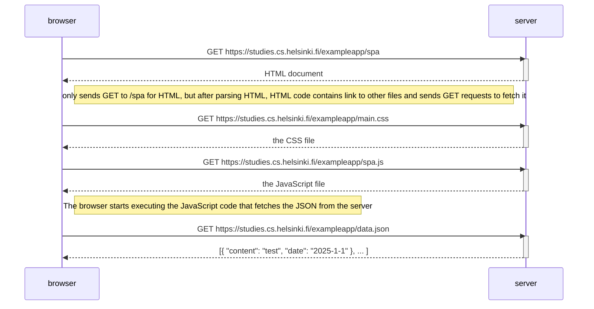

Loading a single-page-app:

```mermaid
  sequenceDiagram;
  participant browser
  participant server

  browser->>server: GET https://studies.cs.helsinki.fi/exampleapp/spa
  activate server
  server-->>browser: HTML document
  deactivate server
  Note right of browser: only sends GET to /spa for HTML, but after parsing HTML, HTML code contains link to other files and sends GET requests to fetch it
  
  browser->>server: GET https://studies.cs.helsinki.fi/exampleapp/main.css
  activate server
  server-->>browser: the CSS file
  deactivate server

  browser->>server: GET https://studies.cs.helsinki.fi/exampleapp/spa.js
  activate server
  server-->>browser: the JavaScript file
  deactivate server

  Note right of browser: The browser starts executing the JavaScript code that fetches the JSON from the server

  browser->>server: GET https://studies.cs.helsinki.fi/exampleapp/data.json
  activate server
  server-->>browser: [{ "content": "test", "date": "2025-1-1" }, ... ]
  deactivate server
```
